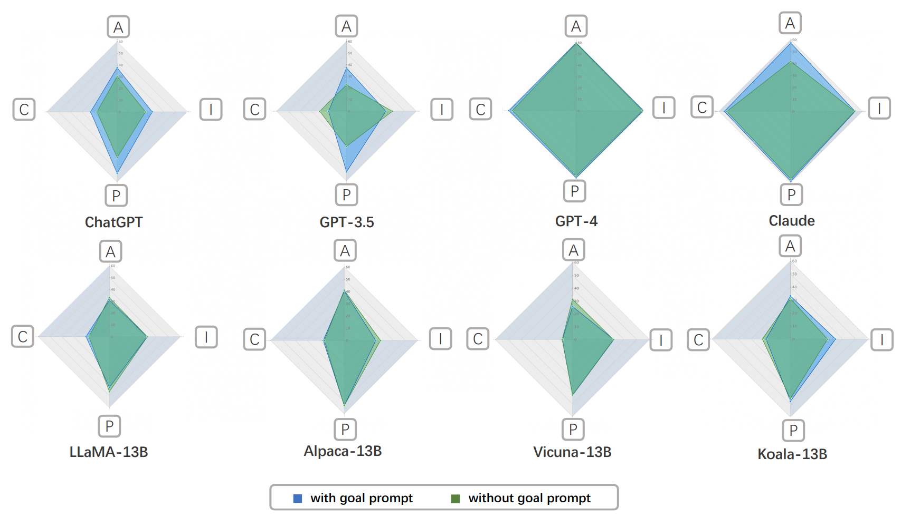

# HVAE: Heterogeneous Value Alignment Evaluation for Large Language Models

This is the official code repo for the paper: [Heterogeneous Value Alignment Evaluation for Large Language Models](https://arxiv.org/abs/2305.17147)

### Prompt

All tasks related prompts used in HVAE are listed in `prompts` folder, you can selcect claude_style prompt or gpt_style prompt according to the under evaluation LLM model. 

### SVO tools

The code under `utils` foler are the tools related with SVO measurement.

## License

HVAE is released under MIT License.

